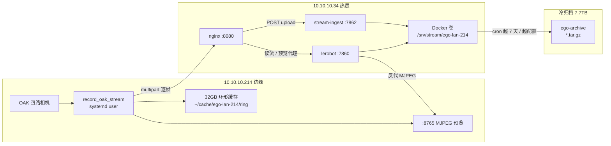

# Data Lab EGO 采集存储架构（边缘 + 热缓存 + 冷归档）

本文档描述 **10.10.10.214 采集站** 与 **10.10.10.34 Data Lab 平台** 之间流式采集数据的存储分层、目录位置、配置项与运维命令。适用于 `ego-lan-214` 站点。

**设计原则**

- 214：**边缘主存储**（32GB 环形缓存），断网可采、联网续传。
- 34：**热数据缓存**（20GB / 7 天），负责接入、实时预览/回放，**不长期保存全量历史**。
- 冷盘：**全量归档**（7.7TB），承接热层淘汰的完整会话数据。
- **不改动** POST 上传接口、Token 鉴权、MJPEG 预览代理、ingest 核心业务逻辑；迁移与清理以**会话级**脚本完成。

---

## 1. 架构总览



**标准数据流**

```text
214 边缘采集 → POST 上传 → 34 热缓存（mux + 7 天 / 20GB）→ 冷盘 tar.gz 归档
```

---

## 2. 存储分层参数

| 层级 | 机器 | 容量策略 | 保留策略 | 角色 |
|------|------|----------|----------|------|
| 边缘环形缓存 | 214 | **32GB**（`EGO_RING_QUOTA_GB`） | 满盘按会话 **LRU 覆盖最旧** | 断网落盘、续传队列 |
| 热缓存 | 34 | **20GB**（`STREAM_QUOTA_GB_EGO_LAN_214`） | **7 天**（`STREAM_RETENTION_DAYS`） | 接入、预览、短期回放 |
| 冷归档 | 34 宿主机 | 约 **7.7TB** 盘 | 长期 | 热层淘汰会话的完整副本 |

---

## 3. 存储路径一览

### 3.1 214 采集站（10.10.10.214）

| 用途 | 路径 | 说明 |
|------|------|------|
| 环形缓存根目录 | `/home/server/cache/ego-lan-214/ring` | 每帧 JPG + `meta.json`，上传成功后删除 |
| 上传断点 | `/home/server/cache/ego-lan-214/checkpoint/ego-stream-checkpoint.json` | `sessionId`、`nextFrameIndex` |
| 本地 MJPEG 预览 | `http://127.0.0.1:8765/preview/{cam}/mjpeg` | 不依赖 34 磁盘 |
| 采集代码 | `/home/server/workspace/ego-studio` | `.venv` 约 15GB，**勿删** |
| systemd 用户服务 | `~/.config/systemd/user/ecs-record-oak-stream.service` 等 | 采集：`ecs-oak-capture-stack.target`；上传：`ecs-oak-upload-stack.target` |
| 上传目标 URL | `http://10.10.10.34:8080/lerobot/api/collection/stations/ego-lan-214/upload` | 不变 |
| 上传 Token | 环境变量 `STATION_UPLOAD_TOKEN=dl-upload-ego-lan-214-v1` | 请求头 `X-Station-Token` |

**环形缓存目录结构（214）**

```text
/home/server/cache/ego-lan-214/ring/
├── registry.json
└── sessions/
    └── sess_<uuid>/
        └── frames/
            └── 00012345/
                ├── meta.json
                ├── observation_images_camera_head_left.jpg
                └── ...
```

### 3.2 34 热层（Docker）

| 用途 | 路径 | 说明 |
|------|------|------|
| 流数据 Docker 卷 | `data-lab_lerobot-stream-data` | 宿主机见下 |
| 卷挂载点（宿主机） | `/var/lib/docker/volumes/data-lab_lerobot-stream-data/_data` | 需 root/docker 组访问 |
| 站点根目录（容器内） | `/srv/stream/ego-lan-214` | ingest / lerobot 共用 |
| 冷归档（容器内） | `/cold-archive` | 绑定宿主机 `ego-archive` |
| 冷归档（宿主机） | `/media/user01/7234c6f9-112e-4b82-925d-7b86065a5f4a/workspace/ego-archive` | `*.tar.gz` 按会话打包 |
| 存储环境配置 | `/opt/datalab/env/stream-storage.env` | cron 脚本 source |
| 迁移日志 | `/opt/datalab/log/hot-tier-enforce.log`、`migrate-archive-docker.log` 等 | |

**热层目录结构（34 容器内 `/srv/stream/ego-lan-214`）**

```text
ego-lan-214/
├── meta/              # info.json, tasks.jsonl
├── data/              # chunk-000/file-000.jsonl（逐帧元数据）
├── videos/            # 各相机 MP4（mux 后）
├── _staging/          # 待 mux 的 JPG（P0：mux 后删除）
├── _staging_tmp/      # 写入缓冲 inflight
├── live/              # session.json, heartbeat.json, mux-state.json, disk-housekeeping.json
├── sessions/          # 每帧幂等标记 *.ok（勿随意整树删除）
├── archive/           # 会话切换时迁入的完整会话目录（待冷迁移）
├── .locks/
└── sessions/...       # 历史会话帧标记
```

### 3.3 34 其它相关路径

| 用途 | 路径 |
|------|------|
| Label Studio 数据 | `data-lab/mydata`（compose 挂载，与流存储独立） |
| 平台配置 | `data-lab-platform/lerobot-studio/config/collection-stations.json` |
| Token 配置 | `data-lab-platform/lerobot-studio/config/collection-station-tokens.json` |
| Compose 存储策略 | `data-lab-platform/docker-compose.storage.override.yml` |

---

## 4. 网络与服务

| 组件 | 地址 | 职责 |
|------|------|------|
| 统一入口 | `http://10.10.10.34:8080` | Label Studio + 网关 |
| 流上传（专用） | `POST /lerobot/api/collection/stations/ego-lan-214/upload` → **stream-ingest:7862** | 避免阻塞 lerobot 主进程 |
| 流读取 / 状态 | `GET /lerobot/api/stream/ego-lan-214/...` → **lerobot:7860** | LeRobot 回放、`/status` |
| 实时预览代理 | `GET /lerobot/api/collection/stations/ego-lan-214/preview/{cam}/mjpeg` | 反代 **214:8765** |
| 采集页 | `/collection?station=ego-lan-214` | Django 模板 + iframe |
| 数据集 URL（逻辑） | `stream://ego-lan-214` → HTTP `/lerobot/api/stream/ego-lan-214/` | 前端/LeRobot |

**nginx 片段**

- 上传：`data-lab-platform/gateway/nginx/snippets/datalab-stream-ingest.conf`
- 注入 shell：`data-lab-platform/gateway/nginx/snippets/datalab-inject.conf`（`shell.js?v=21`）

---

## 5. 上传协议（未改）

214 端 `FrameStreamUploader`（`ego_capture_studio.capture.stream_upload`）按序发送：

1. **heartbeat**（约 15s）：`{"action":"heartbeat","host":"10.10.10.214"}`
2. **session_start**：`sessionId`、`task`、`videoShapes`
3. **frame**（`multipart/form-data`）：JSON `payload` + 多路 **JPEG**

34 端 `stream-ingest.mjs` 处理逻辑（摘要）：

- 帧幂等：`sessionId + frameIndex`，重复帧返回 duplicate，不重复写入。
- 写入：`_staging` JPG + 追加 `data/*.jsonl` + 更新 `meta/info.json`。
- **mux**：ffmpeg 合并为 `videos/*/chunk-000/file-000.mp4`，**P0 成功后删除对应 JPG**。
- 清理：配额 / 保留天数 / staging 紧急阈值（见第 6 节）。

---

## 6. 34 热层策略（环境变量）

通过 `data-lab-platform/docker-compose.storage.override.yml` 注入：

| 变量 | 当前值 | 含义 |
|------|--------|------|
| `STREAM_QUOTA_GB_EGO_LAN_214` | `20` | 站点热数据配额（GB） |
| `STREAM_RETENTION_DAYS` | `7` | 热层 `archive/` 过期天数 |
| `STREAM_DISK_HIGH_WATER` | `0.9` | 触发清理的上水位 |
| `STREAM_DISK_TARGET` | `0.75` | 清理目标占用比 |
| `STREAM_STAGING_EMERGENCY_BYTES` | `268435456`（256MB） | staging 超过则紧急删 JPG |
| `STREAM_CLEANUP_INTERVAL_MS` | `300000`（5min） | 周期清理间隔 |
| `STREAM_ARCHIVE_PURGE_MAX` | `2` | 单次最多删几个热 archive 目录 |
| `STREAM_WINDOW_MINUTES` | `30` | 滚动窗口（viewer，预留） |
| `STREAM_SEGMENT_MINUTES` | `5` | 分段长度（预留） |

**P0 机制（ingest 内，已启用）**

- mux 完成后 `purgeStagingJpgsInDir`，避免 `_staging` 暴涨。
- `getStreamStatus` **不扫全盘**，只读 `live/disk-housekeeping.json`（HTTP 热路径 &lt;5ms）。

**启动 compose（34，仓库根目录）**

```bash
docker-compose -f docker-compose.yml \
  -f data-lab-platform/docker-compose.platform.yml \
  -f data-lab-platform/docker-compose.storage.override.yml \
  up -d stream-ingest lerobot stream-parquet-sync nginx app
```

---

## 7. 214 边缘环形缓存

| 变量 | 值 | 含义 |
|------|-----|------|
| `EGO_EDGE_RING_ENABLED` | `1` | 启用环形缓存 |
| `EGO_RING_ROOT` | `/home/server/cache/ego-lan-214/ring` | 根目录 |
| `EGO_RING_QUOTA_GB` | `32` | 配额 |

**行为**

- `enqueue_frame` 时先 `persist_frame` 落盘，再入上传队列。
- 上传成功（含 duplicate）后 `mark_synced` 删除该帧目录。
- 后台 **ring_backfill** 从磁盘补传未同步帧。
- 超配额时删除**最旧会话**（不删当前 `sessionId`）。

**代码位置（214 部署到 ego-studio）**

- `data-lab-platform/ego-stream-client/edge_ring_store.py`
- `data-lab-platform/ego-stream-client/stream_upload.py`
- systemd：`data-lab-platform/ego-stream-client/systemd/ecs-record-oak-stream.service`
- 用户 drop-in：`~/.config/systemd/user/ecs-record-oak-stream.service.d/ring.conf`

**214 采集 / 上传（systemd 用户服务，采集与上传分离）**

部署单元：`data-lab-platform/ego-stream-client/systemd/` → `~/.config/systemd/user/`，然后 `systemctl --user daemon-reload`。

```bash
# 1. 采集（含心跳；不含上传）
systemctl --user start ecs-oak-capture-stack.target
systemctl --user stop ecs-oak-capture-stack.target
systemctl --user status ecs-oak-capture-stack.target

# 2. 上传（有网后手动开，传完再停）
systemctl --user start ecs-oak-upload-stack.target
journalctl --user -u ecs-upload-segments-loop -f    # 可选：看进度，pending=0 后停
systemctl --user stop ecs-oak-upload-stack.target

# 单服务排障
systemctl --user status ecs-record-oak-stream
journalctl --user -u ecs-record-oak-stream -f
```

---

## 8. 冷迁移与定时任务（34 宿主机）

因 Docker 卷在宿主机上 **user01 可能无读权限**，热层 `archive/` → 冷盘由 **容器内脚本** 完成。

| 脚本 | 作用 |
|------|------|
| `data-lab-platform/scripts/storage/migrate-archive-docker.sh enforce` | 热层 **超 90%×20GB** 时，打包最旧 `archive/*` → `/cold-archive/*.tar.gz` |
| `migrate-archive-docker.sh age` | **≥7 天** 的 `archive/*` 打包冷迁 |
| `hot-tier-enforce.sh` | 无宿主机权限时自动转调 `migrate-archive-docker.sh enforce` |
| `archive-to-cold.sh` | 无宿主机权限时自动转调 `migrate-archive-docker.sh age` |
| `verify-stream-storage.sh` | 自检占用与 status API |
| `setup-ego-archive.sh` | 创建冷盘目录 |

**环境文件**：`/opt/datalab/env/stream-storage.env`（示例见 `scripts/storage/stream-storage.env.example`）

**用户 crontab（当前）**

```cron
*/5 * * * * STREAM_STORAGE_ENV=/opt/datalab/env/stream-storage.env .../hot-tier-enforce.sh
15 */6 * * * STREAM_STORAGE_ENV=/opt/datalab/env/stream-storage.env .../archive-to-cold.sh
```

**手动冷迁**

```bash
export STREAM_STORAGE_ENV=/opt/datalab/env/stream-storage.env
bash data-lab-platform/scripts/storage/migrate-archive-docker.sh age    # 按年龄
bash data-lab-platform/scripts/storage/migrate-archive-docker.sh enforce # 按配额
```

**冷归档文件命名**

```text
/media/user01/.../workspace/ego-archive/<sessionId>_<timestamp>.tar.gz
```

---

## 9. 预览与回放

| 模式 | 数据来源 | 说明 |
|------|----------|------|
| **实时预览** | 214 `:8765` ← 34 lerobot 反代 | 低延迟，不读热盘 MP4 |
| **数据集回放** | 34 `/srv/stream/ego-lan-214` | mux 后的 MP4 + jsonl |

浏览器采集页：`http://10.10.10.34:8080/collection?station=ego-lan-214`（需登录）。

---

## 10. 运维命令速查

### 10.1 34

```bash
# 状态与配额
curl -s http://127.0.0.1:8080/lerobot/api/stream/ego-lan-214/status | python3 -m json.tool

# 容器内热数据大小
docker exec data-lab-stream-ingest-1 du -sh /srv/stream/ego-lan-214 /srv/stream/ego-lan-214/_staging

# 触发 ingest 清理
docker exec data-lab-stream-ingest-1 node --input-type=module -e \
  "import { runDiskCleanupForAllStations } from '/app/stream-ingest.mjs'; runDiskCleanupForAllStations();"

# 自检
export STREAM_STORAGE_ENV=/opt/datalab/env/stream-storage.env
bash data-lab-platform/scripts/storage/verify-stream-storage.sh

# 查看 ingest 日志
docker logs -f data-lab-stream-ingest-1
```

### 10.2 214

```bash
systemctl --user status ecs-record-oak-stream
journalctl --user -u ecs-record-oak-stream -f

du -sh /home/server/cache/ego-lan-214/ring
cat /home/server/cache/ego-lan-214/checkpoint/ego-stream-checkpoint.json
```

### 10.3 清理注意

| 可清理 | 勿删 |
|--------|------|
| 冷盘测试包 `sess_test_cold_*.tar.gz` | 当前活跃 `session` 的 ring 未传帧 |
| `_staging` 可由 ingest 紧急清理 | `ego-studio/.venv` |
| 214 用户 Trash（需 sudo 删 JetPack 残留） | `mydata`、Postgres |
| `__pycache__`、pip 缓存 | 正在写入的 `/srv/stream/ego-lan-214` 热数据 |

---

## 11. 故障排查

| 现象 | 可能原因 | 处理 |
|------|----------|------|
| 34 热盘暴涨 | 旧版未删 staging | 确认 P0 环境已加载；执行 `runDiskCleanupForAllStations` |
| `/status` 很慢 | 全盘 `du` | 应已修复；确认 `disk-housekeeping.json` 存在 |
| 上传 401 | Token 不一致 | 对齐 214 `STATION_UPLOAD_TOKEN` 与 `collection-station-tokens.json` |
| 预览 502 | 214 `:8765` 未起帧 | 查采集进程；nginx 重启后 lerobot IP 变更可 `docker restart data-lab-nginx-1` |
| 冷盘无新 tar | 无满 7 天 archive 或未超配额 | 查 `migrate-archive-docker.log` |
| 采集页 URL 变了内容不变 | SPA 未卸载 overlay | 硬刷新；确认 `shell.js?v=21` |
| 214 断网后丢帧 | ring 未启用 | 检查 `EGO_EDGE_RING_ENABLED=1` |

---

## 12. 相关仓库文件索引

| 类别 | 路径 |
|------|------|
| Ingest 核心 | `data-lab-platform/lerobot-studio/stream-ingest.mjs` |
| Ingest 入口 | `data-lab-platform/lerobot-studio/ingest-server.mjs` |
| Lerobot API | `data-lab-platform/lerobot-studio/server.mjs` |
| 预览反代 | `data-lab-platform/lerobot-studio/preview-proxy.mjs` |
| 214 上传客户端 | `data-lab-platform/ego-stream-client/stream_upload.py` |
| 214 环形缓存 | `data-lab-platform/ego-stream-client/edge_ring_store.py` |
| Compose 热策略 | `data-lab-platform/docker-compose.storage.override.yml` |
| 冷迁脚本 | `data-lab-platform/scripts/storage/*.sh` |
| 采集 Django 页 | `label_studio/templates/datalab/collection_viz.html` |
| App 开发挂载 | `docker-compose.yml`（`urls.py` / `views.py` / `templates` 挂载） |
| 前端 shell | `data-lab-platform/client/shell.js` |
| 优化说明 | `data-lab-platform/lerobot-studio/Stream-Optimization-P0-P3.md` |

---

## 13. 版本记录

| 日期 | 说明 |
|------|------|
| 2026-06-04 | 初始版：32GB 边缘环、34 热层 20GB/7 天、冷盘 `ego-archive`、P0 staging、docker 冷迁脚本、shell v21 |

---

**维护**：变更配额、路径或 cron 后请同步更新本文档与 `/opt/datalab/env/stream-storage.env`。
