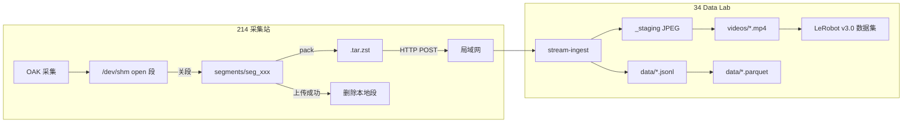

# ego-lan-214 段式存储、上传与 LeRobot v3 数据流

本文档说明 **10.10.10.214 采集站** 与 **10.10.10.34 Data Lab 平台** 之间，基于 **Scheme A（本地 segment + tar.zst 单文件上传）** 的存储路径、目录结构、与 LeRobot v3.0 的关系、上传动作、配额与离线拷贝可行性。

适用于站点 `ego-lan-214`。

**存储分层**：214 边缘段缓存（默认 **256GB** 待导出队列）→ 34 热层 LeRobot 流（默认 100GB / 7 天）→ 34 冷盘 `ego-archive`（长期 tar.gz，见第十一节）。

**离线上传 / 部署 / 默认关自动上传**：见 [ego-edge-offline-upload-and-deployment.md](./ego-edge-offline-upload-and-deployment.md)。

---

## 一、两台机器各自存什么、路径在哪

### 214（采集站 `10.10.10.214`）

**根路径**（systemd 默认）：

```text
/home/server/cache/ego-lan-214/segments/
```

**热写路径**（正在录的 open 段，tmpfs，关段后原子搬到根路径）：

```text
/dev/shm/ego-capture-active/sessions/{sessionId}/segments/seg_XXXXXX/
```

**目录结构**：

```text
segments/
├── checkpoint.json              # 全局断点：sessionId / nextFrameIndex / segmentSeq / task
├── registry.json                # 各 session 元数据（更新时间、pending 段数等）
└── sessions/
    └── sess_<uuid>/
        ├── meta/
        │   └── camera_intrinsics.json   # 相机内参（session_start 时上传）
        └── segments/
            └── seg_000001/
                ├── manifest.json        # 段元数据：帧范围、closed/uploaded 状态
                ├── rows.jsonl           # 每帧 LeRobot 行（state/pose/hands/action…）
                ├── frames/
                │   ├── 00000000.bin     # 4 路相机 JPEG 打包（DLB1 格式）
                │   └── ...
                └── .upload/
                    └── seg_000001.tar.zst   # 上传前本地打包缓存
```

**每段里有什么**：

| 文件 | 内容 |
|------|------|
| `manifest.json` | `session_id`、`segment_id`、起止帧号、`frame_count`、`closed`、`uploaded` |
| `rows.jsonl` | 每行一帧：`frame_index`、`timestamp_ns`、`observation.state`(6)、`observation.pose`(7)、`observation.hands`(63)、`action` 等 |
| `frames/*.bin` | 4 路相机 JPEG（非 MP4），由 `frame_bin_codec` 打包 |

段大小默认：**300 帧** 或 **45 秒**（先到先关），采集 fps 默认 20。

相关代码：`data-lab-platform/ego-stream-client/segment_store.py`、`segment_tar_zst.py`。

---

### 34（Data Lab 平台 `10.10.10.34`）

**宿主机路径**（docker bind-mount）：

```text
data-lab-platform/data-storage/stream/ego-lan-214/
```

**容器内路径**（`stream-ingest` 实际读写）：

```text
/srv/stream/ego-lan-214/
```

**目录结构**（LeRobot v3 流式数据集 + 运行时状态）：

```text
ego-lan-214/
├── live/                          # 运行时状态（非 LeRobot 标准件）
│   ├── session.json               # 当前 session、lastFrameIndex
│   ├── session-registry.json      # 历史 session 登记
│   ├── heartbeat.json             # 214 心跳
│   ├── chunks.json                # 发布/manifest 进度
│   ├── disk-housekeeping.json     # 磁盘清理记录
│   └── sessions/{sess}/segments/seg_xxx.done   # 段去重标记
│
├── meta/                          # LeRobot v3 meta
│   ├── info.json                  # codebase_version: v3.0, features, fps…
│   ├── camera_intrinsics.json
│   └── episodes/chunk-000/file-000.parquet
│
├── data/                          # LeRobot v3 tabular
│   └── chunk-000/
│       ├── file-000.jsonl         # 逐帧行（ingest 实时追加）
│       └── file-000.parquet       # 后台 sync 生成
│
├── videos/                        # LeRobot v3 视频
│   └── observation.images.camera_*/chunk-000/file-000.mp4
│
├── _staging/                      # mux 前临时 JPEG（按相机分目录）
├── .upload/                       # tar.zst 接收/解压临时区（ingest 后删除）
├── .locks/                        # mux/jsonl 文件锁
└── archive/                       # 旧 session 冷归档
    └── sess_xxx_2026-06-29T.../
        ├── data/, videos/, meta/, sessions/
        └── meta/.ready            # 归档完成标记
```

相关代码：`data-lab-platform/lerobot-studio/stream-ingest.mjs`；挂载见 `data-lab-platform/docker-compose.platform.yml`（`./data-storage/stream:/srv/stream`）。

---

## 二、和 LeRobot v3.0 的关系

两端格式**不同**，34 负责**转换**：

```text
214 段格式（中间态）          34 ingest（转换）           LeRobot v3.0 成品
─────────────────────        ─────────────────          ─────────────────
rows.jsonl（行 schema）   →    追加 data/*.jsonl      →    data/*.parquet
frames/*.bin（JPEG 包）   →    解包 → staging JPEG   →    videos/*.mp4（ffmpeg mux）
manifest + intrinsics     →    写 meta/info.json    →    meta/info.json (v3.0)
```

`meta/info.json` 典型字段：`codebase_version: "v3.0"`、`data_path`、`video_path`、`features`（4 路 `observation.images.*`）、`fps: 20` 等。

214 **不存** MP4/parquet；那是 34 ingest 后台任务（mux + parquet sync）的产物。

---

## 三、上传时做了什么（tar.zst 链路）

默认协议：`UPLOAD_PROTOCOL=tarzst`（可回滚为 `multipart`）。

### 214 侧（`segment_upload.py` + `upload_segments_loop.py`）

1. 扫描 `closed=true && uploaded=false` 的段
2. 打包 `manifest.json` + `rows.jsonl` + `frames/*.bin` → `seg_xxx.tar.zst`（zstd L1）
3. 计算 SHA256
4. `POST http://10.10.10.34:8080/lerobot/api/collection/stations/ego-lan-214/upload`
   - Header：`Content-Type: application/zstd`、`X-Upload-Protocol: tarzst`、`X-Session-Id`、`X-Segment-Id`、`X-Content-Sha256`、`X-Station-Token`
5. 成功 → `manifest.uploaded=true`；若 `EGO_SEGMENT_DELETE_AFTER_UPLOAD=1`（默认）→ **异步删除整段目录**

### 34 侧（`stream-ingest.mjs`）

1. 校验 token + SHA256
2. 流式落盘 → `zstd -d | tar -x` 解压
3. 解 `.bin` → 4 路 JPEG，组装 segment body
4. `handleStreamUpload`：逐帧 commit（staging JPEG + jsonl 追加），写 `seg_xxx.done` 防重
5. 后台（约 2s debounce）：ffmpeg mux MP4、parquet sync、viewer publish
6. 删除临时 tar.zst / 解压目录

nginx 上传超时见 `data-lab-platform/gateway/nginx/snippets/datalab-stream-ingest.conf`（默认 300s）。

---

## 四、上传后 214 本地会删吗？

**会**（当前生产配置）：

| 环境变量 | 默认值 |
|----------|--------|
| `EGO_SEGMENT_DELETE_AFTER_UPLOAD` | `1` |
| `EGO_SEGMENT_ASYNC_DELETE` | `1` |

上传成功即标记 `uploaded` 并 `shutil.rmtree` 删除段目录（含 `frames/`、`.upload/`）。

上传失败则保留，等待重试（默认 `EGO_UPLOAD_MAX_RETRIES=3`）。

---

## 五、自动上传还是手动？

| 模式 | 说明 |
|------|------|
| **自动（默认生产）** | `systemctl --user start ecs-oak-upload-stack.target` 启动 `ecs-upload-segments-loop.service`，每 **4s** 轮询，有 pending 段就传 |
| **手动** | `python -m ego_capture_studio.cli.upload_segments --upload-url ... --ensure-session --limit N` |
| **定时（可选）** | `ecs-upload-segments.timer`（每 30 分钟） |

采集栈（`ecs-oak-capture-stack`）和上传栈（`ecs-oak-upload-stack`）**独立**：只开采集、不开上传 → 段只落本地不上传。

systemd 单元模板：`data-lab-platform/ego-stream-client/systemd/ecs-upload-segments-loop.service`。

---

## 六、214 本地存储限额

| 参数 | 默认值 | 行为 |
|------|--------|------|
| `EGO_SEGMENT_QUOTA_GB` | **256 GB** | `segments/` 待导出队列上限；超限时删**最旧**的 closed-unuploaded 段（**不是**生涯总录制量） |
| `SEGMENT_MAX_PENDING` | **10 段** | 采集时 pending 过多，删最旧 pending 段（backpressure） |
| `EGO_UPLOAD_KEEP_PENDING_BELOW` | **12 段** | 上传循环 pending 超 12，trim 最旧段 |

**不是覆盖写同一段**，而是**丢弃最旧未上传段**（未上传数据会丢）。

> **配额含义**：`EGO_SEGMENT_QUOTA_GB` 限制的是 `segments/` **待导出队列**占用，不是生涯总录制量。`ego-export` / 网络上传成功后源段删除，配额循环使用。详见 [field-export-and-import.md §3.7](../data-lab-platform/ego-local-web/field-export-and-import.md)。**导出幂等（B 原料 / C 成品）**见 [§3.8](../data-lab-platform/ego-local-web/field-export-and-import.md)。

采集侧 quota 逻辑至少保留 1 段 pending；上传循环在 disk quota 下也至少留 1 段。

---

## 七、第二天采集会自动清空第一天吗？

### 214

| 场景 | 行为 |
|------|------|
| **保留 `checkpoint.json`** | 续录**同一 session**，帧号接着涨 |
| **删除 `checkpoint.json`** | 新 session（新 `sess_xxx`），帧从 0 起 |
| **已上传段** | 上传后已删 |
| **未上传旧 session** | **不会按日期自动清**，留在 `sessions/` 直到上传或被 quota/trim 丢弃 |

无「跨日零点清空」逻辑。

### 34

| 场景 | 行为 |
|------|------|
| **新 session（非 resume）** | 旧 session 的 `data/videos/meta` **整体移入 `archive/`** |
| **保留策略** | 默认 **7 天**（`STREAM_RETENTION_DAYS=7`），过期 archive 删除 |
| **磁盘配额** | 默认 **100 GB**（`STREAM_QUOTA_GB`），先清 staging JPEG，再删最旧 archive |
| **跨日** | **无按日清空**；靠 session 切换归档 + 保留期 + 配额 |

---

## 八、无网络时 U 盘拷贝能否等效？

**上传通道策略**（W2 起）：**214 `ecs-oak-upload-stack` 为唯一批量主通道**；34 采集页「导入」仅作**单段应急补传**，不具备批量商用可靠性。详见 [ego-lan-214-upload-channel-policy.md](./ego-lan-214-upload-channel-policy.md)。

| 拷贝内容 | 放到 34 哪里 | 能否等效 |
|----------|-------------|----------|
| 214 原始 `segments/` 目录 | 任意路径 | **否** — 34 只认 ingest，不认原始段目录 |
| 214 `.upload/*.tar.zst` | 有网后 **214 Agent** POST | **是** — **批量推荐**（与 `segment_upload.py` 同协议） |
| 214 `.upload/*.tar.zst` | U 盘 → 有网机器 **单段**浏览器拖传 | **是** — 仅 1 段应急补传 |
| 214 `.upload/*.tar.zst` | 任意路径，curl POST + token | **是** — 与 Agent 同协议 |
| 34 已 ingest 的 `data/meta/videos/` | `data-storage/stream/ego-lan-214/` | **部分等同** — 绕过了 ingest 去重/归档/session 管理 |

**离线可行变通**：

1. **有网**：214 上 `systemctl --user start ecs-oak-upload-stack.target`（批量主通道）
2. U 盘拷 `.tar.zst` → 有网后在 34 采集页**单段**拖传（应急，非批量）
3. U 盘拷 214 `segments/sessions/sess_xxx/` → 回 214 原路径 → 有网后 Agent 或打包后单段补传
4. 从任意机器对 34 发 tar.zst HTTP POST（需 token 和正确 header）

**注意**：停录时**未闭合的 open 段**（不足 300 帧）可能留在 tmpfs 或未 finalize，U 盘也拷不到；需录满一段或实现 shutdown flush（`SegmentCaptureWriter.close()` 会 flush，但 `systemctl stop` 需确保进程正常退出）。

---

## 九、数据流总览



---

## 十、实操要点

- **每次开始录制 = 新 session（= 34 上一个 episode）**：`ego_web.py` 在启动采集栈前自动轮换 `checkpoint.json` 中的 `sessionId`，无需手删 checkpoint
- **新一天 / 换场景 / 换操作员**：同样通过「开始录制」自动获得新 session；仅当需强制丢弃未导出段时才手动清 `segments/`
- **214** 是**段缓存队列**（默认 **256GB** 待导出上限），**34** 是 **LeRobot v3 成品库**（默认 100GB / 7 天）
- **默认推荐**：采集栈开启；**有网批量**用 `ecs-oak-upload-stack`（Agent）；浏览器「导入」仅单段应急（见 [ego-lan-214-upload-channel-policy.md](./ego-lan-214-upload-channel-policy.md)）
- 若开启自动网络上传：传完即删（`EGO_SEGMENT_DELETE_AFTER_UPLOAD=1`）；不能把原始 `segments/` 目录直接拷到 34 当 ingest 完成
- 上传 URL：`http://10.10.10.34:8080/lerobot/api/collection/stations/ego-lan-214/upload`
- Token：环境变量 `STATION_UPLOAD_TOKEN=dl-upload-ego-lan-214-v1`（请求头 `X-Station-Token`）

---

## 相关文件

| 组件 | 路径 |
|------|------|
| 段存储 | `data-lab-platform/ego-stream-client/segment_store.py` |
| tar.zst 打包 | `data-lab-platform/ego-stream-client/segment_tar_zst.py` |
| 上传客户端 | `data-lab-platform/ego-stream-client/segment_upload.py` |
| 上传循环 | `data-lab-platform/ego-stream-client/tools/upload_segments_loop.py` |
| 34 ingest | `data-lab-platform/lerobot-studio/stream-ingest.mjs` |
| 帧解包 | `data-lab-platform/lerobot-studio/frame_bin_codec.mjs` |
| systemd 上传 | `data-lab-platform/ego-stream-client/systemd/ecs-upload-segments-loop.service` |
| 站点配置 | `data-lab-platform/lerobot-studio/config/collection-stations.json` |
| 离线上传与部署 | `docs/ego-edge-offline-upload-and-deployment.md` |
| 浏览器导入 UI | `data-lab-platform/client/import-core.js`（单段应急，非批量主通道） |

---

## 十一、34 冷归档（热层 → 冷盘）

热层 `archive/` 中超过保留期或超配额的会话，由宿主机 cron + Docker 脚本打包到冷盘：

| 路径 | 说明 |
|------|------|
| 热层 `archive/`（容器内） | `/srv/stream/ego-lan-214/archive/` |
| 冷盘（宿主机） | `data-storage/ego-archive/`（容器内 `/cold-archive`） |
| 冷包命名 | `<sessionId>_<timestamp>.tar.gz` |

| 脚本 | 作用 |
|------|------|
| `scripts/storage/migrate-archive-docker.sh enforce` | 热层超配额时打包最旧 archive |
| `scripts/storage/migrate-archive-docker.sh age` | ≥7 天的 archive 打包冷迁 |
| `scripts/storage/verify-stream-storage.sh` | 自检占用与 status API |

环境文件示例：`data-lab-platform/scripts/storage/stream-storage.env.example`（部署时常用 `/opt/datalab/env/stream-storage.env`）。

---

## 十二、网络与服务

| 组件 | 地址 | 职责 |
|------|------|------|
| 统一入口 | `http://10.10.10.34:8080` | Label Studio + 网关 |
| 流上传 | `POST .../ego-lan-214/upload` → stream-ingest | tar.zst / multipart |
| 流读取 | `GET /lerobot/api/stream/ego-lan-214/...` | LeRobot 回放 |
| 实时预览 | `.../preview/{cam}/mjpeg` | 反代 214 `:8765` |
| 采集页 | `/collection?station=ego-lan-214` | 在线预览 |

nginx 上传片段：`data-lab-platform/gateway/nginx/snippets/datalab-stream-ingest.conf`。

---

## 十三、34 热层环境变量（摘要）

通过 `data-lab-platform/docker-compose.storage.override.yml` 注入：

| 变量 | 典型值 | 含义 |
|------|--------|------|
| `STREAM_QUOTA_GB` / `STREAM_QUOTA_GB_EGO_LAN_214` | 20–100 | 站点热数据配额（GB） |
| `STREAM_RETENTION_DAYS` | 7 | 热层 archive 过期天数 |
| `STREAM_STAGING_EMERGENCY_BYTES` | 256MB | staging 超限紧急删 JPG |
| `STREAM_CLEANUP_INTERVAL_MS` | 300000 | 周期清理间隔 |

---

## 十四、预览与回放

| 模式 | 数据来源 | 策略 |
|------|----------|------|
| 远程实时（34） | 214 待机预检 `:8765`（`ecs-preview-standby`） | **仅 `captureState=idle`**；采集中 403 |
| 本机实时（214 WiFi） | 采集中采集进程内 `:8765` | 操作员本机预览，不经 34 |
| 数据集回放 | 34 `/srv/stream/ego-lan-214` mux 后 MP4 + jsonl | 与采集状态解耦 |

详见 [ego-lan-214-remote-preview-policy.md](./ego-lan-214-remote-preview-policy.md)。

---

## 十五、运维命令速查

### 214

```bash
# 采集 / 上传
systemctl --user start ecs-oak-capture-stack.target
systemctl --user start ecs-oak-upload-stack.target
journalctl --user -u ecs-upload-segments-loop -f

# 段缓存
du -sh /home/server/cache/ego-lan-214/segments
cat /home/server/cache/ego-lan-214/segments/checkpoint.json
```

### 34

```bash
curl -s http://127.0.0.1:8080/lerobot/api/stream/ego-lan-214/status | python3 -m json.tool
du -sh data-lab-platform/data-storage/stream/ego-lan-214
docker logs -f data-lab-stream-ingest-1 --tail 50
```

---

## 十六、故障排查

| 现象 | 可能原因 | 处理 |
|------|----------|------|
| 上传 401 | Token 不一致 | 对齐 214 `STATION_UPLOAD_TOKEN` 与 `collection-station-tokens.json` |
| tar.zst 失败 | 容器缺 `zstd` | `docker exec -u root ... apk add zstd` |
| 34 热盘暴涨 | staging 未清 | 查 ingest 日志 `staging_emergency_purge`；确认 mux 正常 |
| 预览 502 | 214 `:8765` 未起 | 确认采集栈运行 |
| 停录少帧 | open 段未闭合 | 录满 300 帧或正常 stop 触发 flush |
